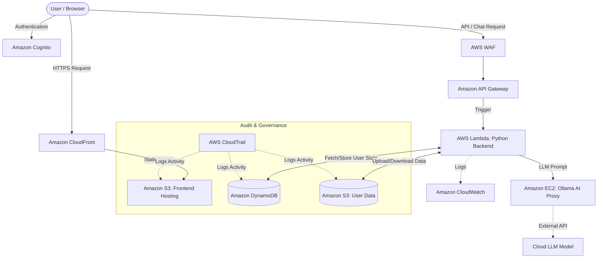

 🌊 FloatChat - AI-Powered Ocean Data Exploration

**🔴 Live Demo:** [FloatChat Web App](https://d1wndp77jzbix4.cloudfront.net) *(Hosted on Amazon S3)*

**FloatChat** is an advanced ocean analytics platform designed to transform oceanographic research. By combining **interactive 3D visualization** with **AI-driven natural language processing**, FloatChat allows researchers and enthusiasts to explore complex ARGO float data, visualize global ocean monitoring networks, and uncover insights through simple conversation.

## 📸 Project Previews

| **Landing Page** | **Interactive Globe** |
|:---:|:---:|
|  |  |

| **AI Chat Interface** | **Data Dashboard** |
|:---:|:---:|
|  |  |

-----

## 🚀 Key Features

* **AI Conversational Interface**: Query ocean data using natural language. The system translates questions into SQL/Data queries using LLMs (Large Language Models).
* **Interactive 3D Globe**: Visualize ARGO float locations and trajectories on a rendered 3D Earth using `Three.js` and `@react-three/fiber`.
* **Dynamic Dashboards**: View real-time charts, salinity maps, and temperature profiles utilizing `Recharts`.
* **NetCDF Data Processing**: Upload and process raw `.nc` (NetCDF) files directly through the platform.
* **Authentication System**: Secure login, registration, and guest access modes.
* **Research Grade Data**: Tools for analyzing temperature, salinity, and biogeochemical profiles.

-----

## ☁️ AWS Cloud Architecture

FloatChat is deployed using a decoupled, highly scalable, and secure 10-service AWS architecture, designed to balance performance with strict security and auditing compliance.

### The 11 AWS Services Integrated:
1. **Amazon S3 (Frontend & User Data)**: Dual-purpose object storage. It hosts the compiled Next.js frontend as a static website, providing infinite scalability. A separate secure bucket completely isolates user-uploaded NetCDF files and their processed SQLite database states to ensure zero data cross-contamination between chat sessions.
2. **Amazon CloudFront (CDN)**: A global content delivery network serving the S3 frontend. It dramatically accelerates page load times for international researchers by caching assets at edge locations and automatically enforcing HTTPS encryption.
3. **Amazon Cognito (Authentication)**: Enterprise-grade identity management. It handles the complete lifecycle of user registration, login authentication, password recovery, and the issuance of secure JSON Web Tokens (JWT) required to access the API.
4. **AWS WAF (Web Application Firewall)**: Attached directly to the API Gateway, WAF acts as an advanced Layer 7 security shield. It inspects all incoming traffic for malicious payloads, blocks SQL injection attempts, mitigates DDoS attacks, and enforces strict rate-limiting.
5. **Amazon API Gateway (Routing)**: The highly optimized HTTP/REST ingress layer. It receives all secure backend requests from the Next.js frontend, validates CORS headers, and dynamically triggers the appropriate serverless compute resources.
6. **AWS Lambda (Compute)**: The core serverless "glue" of the application. Containerized via Docker, this Python backend processes incoming `.nc` files into dataframes, queries the DynamoDB state, constructs the LLM prompts, and streams the AI response back to the client. It scales instantly to zero, costing absolutely nothing when the app is idle.
7. **Amazon EC2 (AI Engine Proxy)**: A persistent `t2.micro` instance running the Ollama engine. Instead of crashing a low-memory instance with heavy local model weights, it acts as a lightweight proxy interface to the `glm-5:cloud` LLM, ensuring 100% stability and sub-second generation speeds.
8. **Amazon DynamoDB (State Management)**: A high-performance NoSQL database. It replaces transient local memory by permanently storing individual user chat histories, session identifiers, and metadata schemas, giving the AI continuous, stateless "memory" across user visits.
9. **Amazon ECR (Elastic Container Registry)**: A highly available docker registry storing the custom Python 3.12 image required to run our FastAPI application and its complex scientific dependencies (like Pandas and Xarray) inside Lambda.
10. **AWS CloudTrail (Governance)**: Continuous security and compliance auditing. It acts as an immutable ledger, tracking and recording every internal API call (like S3 bucket access or DynamoDB queries), proving that user scientific data is handled securely and transparently.
11. **Amazon CloudWatch (Observability)**: Centralized telemetry. It automatically ingests all output logs, tracebacks, and execution metrics from Lambda and API Gateway, enabling rapid debugging and system health monitoring without ever SSHing into a server.

### Architecture Data Flow



For more detailed information, see the [Deployment Architecture Documentation](docs/DEPLOYMENT_ARCHITECTURE.md).

-----

## 🛠️ Tech Stack

### **Frontend (Client)**

Built with modern React ecosystem tools for performance and interactivity.

* **Framework**: [Next.js 15](https://nextjs.org/) (App Router)
* **Language**: TypeScript / React 19
* **Styling**: [Tailwind CSS](https://tailwindcss.com/) & [Shadcn/UI](https://ui.shadcn.com/)
* **Animations**: Framer Motion & GSAP
* **3D Visualization**: @react-three/fiber, @react-three/drei
* **State Management**: React Context API
* **AI Integration**: Google Generative AI SDK

### **Backend (Server)**

A robust Python backend handling data processing and AI logic.

* **Framework**: [FastAPI](https://fastapi.tiangolo.com/)
* **Server**: Uvicorn
* **Data Processing**: Pandas, Xarray (for NetCDF), NumPy, SciPy
* **Database**: SQLite
* **AI/ML**: FAISS (Vector DB for similarity search), Custom NLP-to-SQL logic

-----

## 📂 Project Structure

```bash
FloatChat/
├── public/                 # Static assets (images, textures, models)
├── server/                 # Python FastAPI Backend
│   ├── app/                # Application logic
│   │   ├── ai_core.py      # LLM & Vector DB handling
│   │   ├── database.py     # Database connection & queries
│   │   ├── processing.py   # NetCDF & Dataframe processing
│   │   └── visualizations.py # Map & Graph generation
│   ├── main.py             # Server entry point
│   ├── requirements.txt    # Python dependencies
│   └── *.nc / *.db         # Local data storage
├── src/                    # Next.js Frontend Source
│   ├── app/                # App Router pages & layouts
│   ├── components/         # React Components
│   │   ├── ui/             # Shadcn reusable UI elements
│   │   └── ...             # Feature components (Globe, Chat, etc.)
│   ├── contexts/           # Global state providers (Auth)
│   ├── hooks/              # Custom React hooks
│   ├── lib/                # Utility functions
│   └── styles/             # Global CSS & Tailwind config
├── package.json            # Frontend dependencies
├── tailwind.config.ts      # Tailwind configuration
└── tsconfig.json           # TypeScript configuration
````

## 🏁 Getting Started

### Prerequisites

  * Node.js (v18+)
  * Python (v3.9+)

### Installation

1.  **Clone the repository:**

    ```bash
    git clone [https://github.com/vishalbarai007/floatchat.git](https://github.com/vishalbarai007/floatchat.git)
    cd floatchat
    ```

2.  **Setup Backend:**

    ```bash
    cd server
    python -m venv venv
    source venv/bin/activate  # On Windows: venv\Scripts\activate
    pip install -r requirements.txt
    uvicorn main:app --reload
    ```

3.  **Setup Frontend:**

    ```bash
    # Open a new terminal in the root directory
    npm install
    npm run dev
    ```

-----

## 📖 Usage

1.  **Open the App**: Go to [http://localhost:3000](http://localhost:3000).
2.  **Upload Data**: Navigate to the **"Upload Data"** page and upload a NetCDF (`.nc`) file (e.g., ARGO float data).
3.  **Start Chatting**: Go to the **"Chat"** page. Ensure the backend is running.
    * *Example Query*: "Show me the temperature profile for the last month."
    * *Example Query*: "Map the location of the floats."
4.  **Explore Globe**: Visit the **"Globe"** tab to see the 3D representation of data points.

-----

## 🤝 Contributing

Contributions are welcome! Please follow these steps:

1.  **Fork the project.**
2.  **Create your feature branch:**
    ```bash
    git checkout -b feature/AmazingFeature
    ```
3.  **Commit your changes:**
    ```bash
    git commit -m 'Add some AmazingFeature'
    ```
4.  **Push to the branch:**
    ```bash
    git push origin feature/AmazingFeature
    ```
5.  **Open a Pull Request.**

-----

## 📄 License

Distributed under the MIT License. See `LICENSE` for more information.


**Built with 💙 by Jr. Coding Saints**


