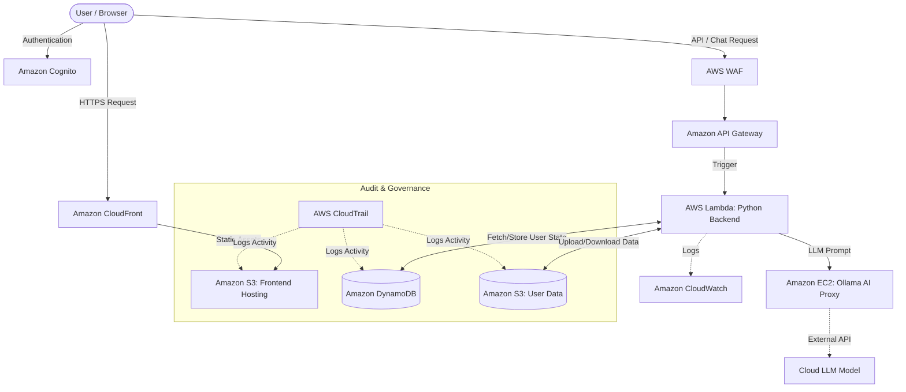

# FloatChat Comprehensive AWS Deployment Architecture

**🔴 Live Demo:** [https://d1wndp77jzbix4.cloudfront.net](https://d1wndp77jzbix4.cloudfront.net) *(Hosted on Amazon S3)*

This document outlines the complete, highly decoupled cloud architecture designed to host FloatChat. To meet enterprise standards for performance, security, and auditing compliance—while operating largely within the AWS Free Tier—the platform integrates **11 distinct AWS Services**.

By utilizing a serverless approach for the frontend and backend, isolating the AI processing to a dedicated instance, and implementing stringent data isolation, this architecture ensures high performance, compliance, and scalability.

---

## 🏗️ Architecture Overview

The system is broken down into four distinct phases of deployment, ensuring separation of concerns:

1. **The Edge & Frontend Delivery** (S3 + CloudFront)
2. **The Security & Ingress Layer** (WAF + API Gateway + Cognito)
3. **The Serverless Compute Engine** (Lambda + ECR + CloudWatch)
4. **Data, State, and Governance** (DynamoDB + S3 + EC2 + CloudTrail)

---

## 1. The Edge & Frontend Delivery

### Amazon S3 (Static Website Hosting)
The frontend is a modern Next.js 15 React application. Instead of running a costly Node.js server to render pages, the application is compiled into pure, static HTML, CSS, and JavaScript using `next build` and `output: 'export'`. 
* These static assets are placed in a public-facing S3 bucket (`floatchat-frontend`).
* **Benefit:** Infinite scalability. S3 can serve millions of concurrent users without breaking a sweat, and at a fraction of the cost of a traditional web server.

### Amazon CloudFront (CDN)
A global Content Delivery Network (CDN) sits directly in front of the S3 bucket.
* **Benefit 1:** CloudFront caches the static UI at Edge locations worldwide, ensuring researchers in Europe or Asia experience instant load times, identical to users near the origin server.
* **Benefit 2:** It provides enterprise-grade HTTPS/SSL encryption out of the box, fulfilling modern browser security requirements for utilizing the frontend microphone/upload capabilities.

---

## 2. The Security & Ingress Layer

### Amazon Cognito
Handling user identity in a distributed application requires a dedicated Identity Provider (IdP).
* Cognito manages the FloatChat user pools. It handles secure user registration, email-based login, password recovery, and the issuance of secure JWT (JSON Web Tokens).
* The Next.js frontend uses AWS Amplify to seamlessly communicate with Cognito to enforce session management.

### Amazon API Gateway
The API Gateway acts as the high-speed, secure front-door for all backend operations.
* It exposes HTTP endpoints (e.g., `/chatbot-response` and `/upload-data`) that the frontend calls via standard REST/Fetch APIs.
* **Benefit:** API Gateway automatically handles CORS (Cross-Origin Resource Sharing) policies and can instantly route requests to various serverless functions without maintaining a persistent server connection.

### AWS WAF (Web Application Firewall)
Attached directly to the API Gateway, WAF serves as an advanced Layer 7 security shield.
* **Benefit:** It inspects all incoming traffic *before* it reaches the backend logic. WAF actively blocks SQL injection attempts, filters out malicious bots, and rate-limits traffic to ensure the downstream AI model is never overwhelmed by a DDoS attack.

---

## 3. The Serverless Compute Engine

### AWS Lambda
The core business logic (FastAPI, Pandas, Xarray) is entirely Serverless.
* When API Gateway receives a request, it triggers the Lambda function. Lambda spins up an isolated execution environment, runs the Python code to process the NetCDF file or query the database, returns the response, and instantly "dies."
* **Cost Efficiency:** Because it scales to exactly zero when no one is using the application, compute costs are completely eliminated during downtime.

### Amazon ECR (Elastic Container Registry)
Standard Lambda functions are limited to a 250MB deployment size. Because scientific computing requires heavy libraries (like Pandas, NumPy, Xarray, and FAISS), this limit is easily exceeded.
* **The Solution:** The backend is packaged as a Docker container using a Python 3.12 base image and pushed to Amazon ECR. Lambda is configured to boot directly from this Docker image, allowing for a massive 10GB deployment footprint.

### Amazon CloudWatch
Without traditional servers to SSH into, observability is critical.
* CloudWatch acts as the centralized telemetry ingestion point. It automatically captures all `print()` statements, execution metrics, memory usage statistics, and Python tracebacks generated by the Lambda function, allowing for rapid debugging.

---

## 4. Data, State, and Governance

### Amazon DynamoDB
In a serverless architecture, Lambda functions are fundamentally stateless (they have no memory of previous executions). 
* DynamoDB, a blazing-fast NoSQL database, solves this by permanently storing application state.
* **Tables:** 
  1. `Users`: Stores user profiles.
  2. `ChatHistory`: Stores every prompt and AI response (Partitioned by `userId`, Sorted by `timestamp`).
  3. `Sessions`: Stores the dynamic column schemas of uploaded data. When a user asks a follow-up question, Lambda queries DynamoDB to instantly remember the context of their specific dataset.

### Amazon S3 (User Data Isolation)
A secondary S3 bucket (`floatchat-user-data`) is provisioned strictly for backend storage.
* When a user uploads a `.nc` file, Lambda processes it into a fast `.db` SQLite file. Both files are permanently saved to this S3 bucket under a unique `<userId>/<sessionId>/` prefix.
* If a user logs out and logs back in tomorrow, Lambda seamlessly downloads their specific `.db` file from S3 back into its temporary `/tmp/` storage and continues the conversation where they left off.

### Amazon EC2 (The AI Proxy)
Running a Large Language Model (LLM) locally requires significant RAM (4GB–8GB+), which would crash a Free Tier server.
* **The Solution:** We run the Ollama engine on a small `t2.micro` EC2 instance, but utilize the `glm-5:cloud` model. This turns the EC2 instance into a lightweight proxy. Zero model weights are loaded into the EC2 instance's RAM, keeping the server 100% stable while routing the processing to a high-powered cloud API.

### AWS CloudTrail
To meet enterprise compliance standards for handling raw scientific data, complete transparency is required.
* CloudTrail acts as an immutable auditing ledger. It continuously monitors the entire AWS account and records every single internal API call. 
* **Example:** If Lambda reads a user's data from S3, or if a new user is added to Cognito, CloudTrail logs the exact timestamp, IP address, and identity of the caller to a dedicated audit bucket, ensuring zero-trust governance.

---

## 🔄 Data Flow & Request Lifecycle

### Step-by-Step Lifecycle

1. **User interaction:** A researcher visits the FloatChat URL. The Next.js static files are served instantly via **CloudFront** from the **S3 Frontend** bucket.
2. **Authentication:** The researcher logs in. The UI authenticates securely against the **Cognito** User Pool, returning a valid session token.
3. **Action:** The researcher uploads an ARGO float `.nc` file in the UI.
4. **Routing & Security:** The Next.js app sends an HTTPS POST request to the **API Gateway**. The request is first inspected by **WAF** to ensure it is not a malicious payload.
5. **Logic:** API Gateway routes the request to the **AWS Lambda** container.
6. **Data Processing:** Lambda processes the `.nc` file using Pandas/Xarray, converts it to a SQL database, and immediately offloads this `.db` file to the **S3 User Data** bucket to ensure it isn't lost when Lambda spins down. It then saves the data schema (column names) into **DynamoDB**.
7. **Querying:** When the user types, "What is the average temperature?", Lambda wakes back up. It retrieves the user's specific database file from **S3**, executes a SQL query on it, and constructs a contextual prompt.
8. **AI Generation:** Lambda sends this prompt via an internal HTTP request to the **EC2 instance** running Ollama.
9. **Response:** Ollama generates the response and streams it back to Lambda, which passes it through API Gateway directly to the user's browser.
10. **Auditing:** Throughout this entire lifecycle, **CloudTrail** silently logs every internal AWS action (like DynamoDB queries or S3 writes) for strict security and auditing compliance.
